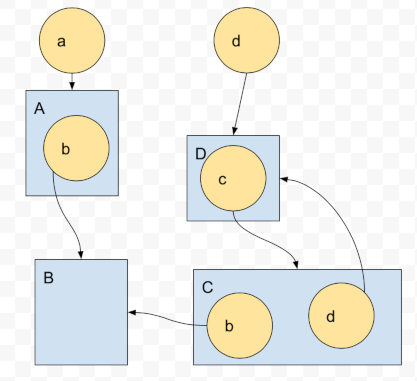

# Æether Object
[](https://opensource.org/licenses/Apache-2.0)


is a C++11 cross-platform architecture heder-only framework for creating lightweight, highly structured, easily supportable, reliable, distributed applications.

The core concept is well-known from other frameworks: an application is represented as a graph, and each node is a serializable class instance.

## Hello, world!

In the example, an application graph is constructed with the application objects **A** and **B** and then serialized into the user-provided storage, for example, into files.

Then the application graph with the whole hierarchy can be restored from that serialized state.

```cpp
#include "aether/obj/obj.h"
class A : public aether::Obj {
public:
  AETHER_OBJ(A);
  template <typename T> void Serializator(T& s, int flags) { s & i_; }
  int i_;
};
AETHER_IMPL(A);

class B : public aether::Obj {
public:
  AETHER_OBJ(B);
  template <typename T> void Serializator(T& s, int flags) { s & objs_; }
  std::vector<A::ptr> objs_;
};
AETHER_IMPL(B);

int main() {
  {
    // Constructing and serializing the application's graph.
    B::ptr o{aether::Obj::CreateObjByClassId(B::kId)};
    o.Serialize([](stream& s) {/*writing files*/}, flags);
  }
  {
    // Loading the application's graph.
    B::ptr o;
    o.Load([](...) {/*enumerate files*/}, [](...) { /*loading files*/});
    // The graph is restored and can be accessed.
    std::cout << "A::i_ = " << o->objs_[0]->i_ << "\n";
  }
}
```

## Key features

*   **Serialization** of the whole application state with a little effort
*   **Hibernating/waking-up** parts of the application’s graph
*   **Upgrade** of the application is just the replacing a part of serialized state
*   **Versioning** of the serialized state and executable is automatic: simplifies upgrade and messaging between application’s instances
*   **Model-Presenter** for cross-platform applications with event-driven model change
*   **Debugging, automated testing**: event-driven model records all state changes and can be reproduced in any platform-specific environment
*   **Code size, performance, reliability**. The application is split into development mode, where the graph is constructed, all intermediate resources are pre-compiled and verified and is just deserialized then from binary.
*   **Distributed** applications just share the part of the graph.


## Example application

A cross-platform (Windows, macOS, iOS, Android) text editor with automatic saving text, window position and size.


- [Class casting](#class-casting)
  - [Inheritance](#inheritance)
  - [Inheritance chain](#inheritance-chain)
- [Serialization](#serialization)
  - [Class state serialization](#class-state-serialization)
  - [Class pointer serialization](#class-pointer-serialization)
  - [Versioning](#versioning)
  - [Hibernate, Wake-up](#hibernate-wake-up)
  - [Multiple references](#multiple-references)
  - [Cyclic references](#cyclic-references)
  - [Serialization flags](#serialization-flags)
  - [Domain, example - localization](#domain-example-localization)
- [Development runtime modes](#development-runtime-modes)
  - [#ifdefs - initial state]
  - [Runtime obj creation - cloning]
- [Event-driven](#event-driven)
  - [Collapse events into state, per sub-graph]
- [Model-Presenter](#model-presenter)
  - [Cross-platform]]
  - [Mix: model-presenter-model-presenter]
  - [Empty presenter, reproducing problems, telemetry]
  - [Automated tests for whole app with empty presenters]
- [Header-only, custom streams, exception handling, RAII](#Header-only-custom-streams-exception-handling-RAII)
- [Multithreading fast serialization and double-buffering](#multithreading-fast-serialization-and-double-buffering)
- [Developing changing resource in run-time](#developing-changing-resource-in-run-time)


## Class casting

Any class of an application is inherited from the Obj class. *AETHER_OBJ(class name)* macro is used to declare all supporting internal functions. An Object is wrapped into the Ptr<T> template class and the pointer type is declared as *MyClass::ptr*. Obj base class contains the references counter.
```cpp
MyClass* ptr = new MyClass();
MyClass::ptr p1(ptr);  // Increments the reference counter = 1.
MyClass::ptr p2(ptr);  // Increments the reference counter = 2.
p1 = nullptr;  // Decrements ref_counter = 1.
p2 = nullptr;  // Decrements ref_counter = 0 and the class instance is deleted.
```
*AETHER_IMPL(ClassName)* should be declared in cpp-file. The macro registers the class factory function.

### Inheritance
Each class inherited from the Obj class supports efficient dynamic poiter downcasting without using C++ RTTI.
```cpp
class A : public aether::Obj {
 public:
  AETHER_OBJ(A);
};
class B : public aether::Obj {
 public:
  AETHER_OBJ(B);
};
aether::Obj::ptr o{new B()};
A::ptr a = o;  // Can't cast to A* so the pointer remains nullptr
B::ptr b = o;  // Resolved to B*
```
The "Diamond problem" can be resolved by the "class A : public **virtual** aether::Obj" inheritance.
If a class supports casting to multiple base classes with multiple inheritance or with chain of base classes then multiple classes can be enumerated in th *AETHER_OBJ(ClassName)* macro.
```cpp
class Base1 : public virtual aether::Obj {
 public:
  AETHER_OBJ(Base1);
};
class Base2 : public virtual aether::Obj {
 public:
  AETHER_OBJ(Base2);
};
class Derived : public Base1, public Base2 {
 public:
  AETHER_OBJ(Derived, Base1, Base2);  // Cuurent class must be listed at the first place.
};
aether::Obj::ptr o{new Derived()};
Base1::ptr b1 = o;
Base2::ptr b2 = o;
```

Interface classes (i.e. not able to be instantiated) are defined with the same way but without AETHER_IMPL macro.

### Inheritance chain
If *aether::Obj::CreateObjByClassId("ClassName")* method is used instead of *new ClassName* then the inheritance chain is evaluated and the last class is instantiated. It is useful for instantiating the interface implementation:
```cpp
class Interface : public aether::Obj {
 public:
  AETHER_OBJ(Interface);
};
class Implementation : public Interface {
 public:
  AETHER_OBJ(Implementation, Interface);  // The inheritance chain is listed here.
};
// The pointer refers to the Implementation class instance.
Interface::ptr interface = aether::Obj::CreateObjByClassId("Interface");
```

## Serialization
Serialization of the application model/state is done with input/output stream that saves an object data, references to other objects. A special *mstream* class is provided but any other custom stream with required functionality can be used. A user-side call-backs implement saving/loading the serialized data, for example as files, or database etc.

### Class state serialization
To avoid possible mistmatches when class members are serialized and deserialized a unified bidirectional method is used:
```cpp
class A : public aether::Obj {
 public:
  AETHER_OBJ(A);
  int i_;
  std::vector<std::string> strings_;  
  template <typename T> void Serializator(T& s, int flags) {
    s & i_ & strings_;
  }
  virtual void OnLoaded() {}
};
```
**Serializator** method is instantiated with in in/out stream and '<<', '>>' operators are replaced with a single '&'operator.
It is possible to determine the type of the stream at compile time for creating some platform-specific resources:
```cpp
if constexpr (std::is_base_of<aether::istream, T>::value) { ... }
```
If an object accesses another objects are being loaded then it is more convenient to do some logic in
```cpp
  virtual void OnLoaded() {}
```
method which is called after all objects in the subgraph are deserialize.

### Class pointer serialization
A pointer to another object can also be serialized/deserialized in the same way like a built-in type:
```cpp
class A : public aether::Obj {
 public:
  AETHER_OBJ(A);
  int i_;
};

class B : public aether::Obj {
 public:
  AETHER_OBJ(B);
  aether::Obj::ptr o_;  // A reference to the A* class but casted to aether::Obj*
  std::map<int, A::ptr> a_;
  template <typename T> void Serializator(T& s, int flags) {
    s & o_ & a_;
  }
  virtual void OnLoaded() {
    A::ptr(o_)->i_++;  // Valid
    a_[0]->i_++;  // Valid
  }
};
```
If multiple pointers are referencing a single class instance then after deserialization a single class is constructed and then referenced multiple times. Cyclic references are also supported. Each class is registed with the factory function and the unique ClassId. Each class instance = object contains unique InstanceId. Both these values are used for reconstructing the original graph on deserialization.

### Versioning
Versioning is implemented by inheritance chain and supports:
* an old serialized object's state can be loaded by the newer binary. Default initialization of the newly added values is performed.
* An old binary can load newer serialized state with rejecting the unused values.
Another useful application of the versioned serialization is the upgrading application to newer version (with ability to roll-back).
Example: V1 class serializes integer value. When the instance of the class is serialized through the pointer then the ClassId and InstanceId are both serialized. Then the integer is stored.
```cpp
class V1 : public aether::Obj {
 public:
  AETHER_OBJ(V1);
  int i_;
  template <typename T> void Serializator(T& s, int flags) {s & i_; }
};
```
For a newer application version the V1 class is extended by inheritance:
```cpp
class V2 : public V1 {
 public:
  AETHER_OBJ(V2, V1);
  float f_ = 3.14f;
  // Important: the method serializes only V2 data, V1 data is already serialized in V1 class.
  template <typename T> void Serializator(T& s, int flags) {s & f_; }
};
```
When the class is serialized through the pointer then V1::ClassId is stored instead of V2::ClassId. V2 is the last class in the inheritance chain so it will be created with the *CreateObjByClassId* function that creates the last class in the chain. Then a separate blob of data will be stored with the V2's data - floating point number. If an older binary loads the serialized state then V1 class is created and the V2 data is ignored. If newer binary loads the old data then V1::ClassId is loaded and V2 class is created but only V1 data is deserialized. V2 remains in default value.

**Application upgrade** is easily implemented by replacing / adding serialization data for a particular class. All substates of all classes in the inheritance chain is stored individually.

If the versioning is not intended then *AETHER_OBJ(ClassName)* should contain only single class in the list. Also all members of parent class must be serialized.
*AETHER_OBJ* macro is a combination of 3 other macros. Using this allows more flexible configurations:
```cpp
AETHER_OBJ(Derived, Base);
// equivalent to:
AETHER_CLS(Derived);  // ClassId etc. definition
AETHER_INTERFACE(Derived, Base);  // List of all allowed base classes for pointer casting.
AETHER_SERIALIZE(Derived, Base);  // Serialization chain
```

### Hibernate, Wake-up
An application is represented as a graph and some subgraphs can be loaded and some can be off-loaded at a moment. For example, an application can open a document while other documents remain off-loaded. Obj::ptr represents a shared pointer with reference-counting and the object can be loaded or not. When the pointer is serialized and then deserialized then the loaded/unloaded state is preserved. An object holding the unloaded reference to another object can load the object at any given time:
```cpp
Doc::ptr doc_;
void SomeMethod() {
  doc_.Load();
  doc_->AddString("example of method call");  // Some user-defined state change.
  doc_->Serialize(user_defined_callback_fn, aether::Obj::Serialization::kData););
  doc_->Unload();
}
```
The doc_ is loaded from the saved state. Then the state of the object is changed and then the object is serialized with the new state. The object is unloaded then but it can remain loaded. The loaded/unloaded object must be referenced only by a single pointer. If an unloaded object's pointer is copied then the copy is nullptr.

User-defined callbacks are passed into the Load and Serialize methods to allow objects state storing, loading and enumerating:
```cpp
using StoreFacility = std::function<void(const ObjId& obj_id, uint32_t class_id, ObjStorage storage,
                                         const AETHER_OMSTREAM& os)>;
using EnumerateFacility = std::function<std::vector<uint32_t>(const ObjId& obj_id, ObjStorage storage)>;
using LoadFacility = std::function<void(const ObjId& obj_id, uint32_t class_id, ObjStorage storage,
                                        AETHER_IMSTREAM& is)>;
```
In the example application a file storage is used:
* each object is serialized into the separated directory
* InstanceId is the name of the directory
* a separate file with the name of class_id for each class in the inheritance chain is use for storing the data
* the whole graph of the application is linearized into plain structure where all objects are placed on top level

### Multiple references
When an object's pointer is deserialized the object is being searched with the unique ObjectId if the object is already loaded by another upper-level node. If it is loaded then it's just referenced. If the object is referenced multiple times and the pointer is unloaded then the object remains alive.

### Cyclic references
For a particular object pointer that references other objects and is being to be unloaded only object referenced within the subgraph are unloaded. That also includes cyclic references:
```cpp
class A { B::ptr b_; };
class B { A::ptr a_; };
A::ptr a;
a.Unload();  // B and A referenced with the subgraph only
```
More complex case:

If E is unloaded then A and B remains loaded.

### Serialization flags
All serialization / deserialization methods uses flags:
* kData - the data of the object is stored
* kRefs - references to other objects are stored. The method also used for graph analysis
* kConsts - It is impractical to serialize all objects' data every time because a lot of objects are just constant: localization strings, images etc. These objects are marked as Constants and only references to the objects are serialized of the kConsts flag is not specified. Tips: if an object contains constant and non-constant data members then it is better to split the object into two: a dynamic object with reference to the static object. Also it simplifies the application upgrade when the static object can be upgraded independently.

### Domain, example - localization
Distributed applications
        Domains: local / user / global states
        Superroot
        Different versions of events
        Simultaneous editing of a document

## Development runtime modes

### #ifdefs - initial state

### Runtime obj creation - cloning
cloning from alive obj
cloning from unloaded obj
subgraph cloning
* shallow
* deep
* full

## Event-driven
### Collapse events into state, per sub-graph {#collapse-events-into-state-per-sub-graph}

## Model-Presenter
### Cross-platform
### Mix: model-presenter-model-presenter
### Empty presenter, reproducing problems = telemetry {#empty-presenter-reproducing-problems-=-telemetry}
### Automated tests for whole app with empty presenters {#automated-tests-for-whole-app-with-empty-presenters}


## Header-only, custom streams, exception handling, RAII
## Multithreading fast serialization and double-buffering
## Developing changing resource in run-time
