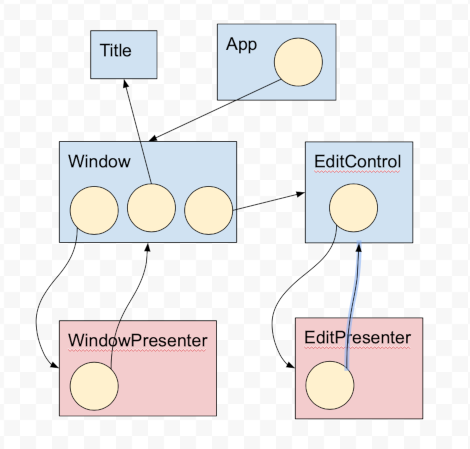

# Æether Object
[](https://opensource.org/licenses/Apache-2.0)


is a C++11 cross-platform architecture header-only framework for creating lightweight, highly structured, easily supportable, reliable, distributed applications.

The core concept is well-known from other frameworks: an application is represented as a graph, and each node is a serializable class instance.

## Hello, world!

In the example, an application graph is constructed with the application objects **A** and **B** and then serialized into the user-provided storage, for example, into files.

Then the application graph with the whole hierarchy can be restored from that serialized state.

```cpp
#include "aether/obj/obj.h"
class A : public aether::Obj {
public:
  AETHER_OBJ(A);
  template <typename T> void Serializator(T& s, int flags) { s & i_; }
  int i_;
};
AETHER_IMPL(A);

class B : public aether::Obj {
public:
  AETHER_OBJ(B);
  template <typename T> void Serializator(T& s, int flags) { s & objs_; }
  std::vector<A::ptr> objs_;
};
AETHER_IMPL(B);

int main() {
  {
    // Constructing and serializing the application's graph.
    B::ptr o{aether::Obj::CreateObjByClassId(B::kId)};
    o.Serialize([](stream& s) {/*writing files*/}, flags);
  }
  {
    // Loading the application's graph.
    B::ptr o;
    o.Load([](...) {/*enumerate files*/}, [](...) { /*loading files*/});
    // The graph is restored and can be accessed.
    std::cout << "A::i_ = " << o->objs_[0]->i_ << "\n";
  }
}
```

## Key features

*   **Serialization** of the whole application state with a little effort
*   **Hibernating/waking-up** parts of the application’s graph
*   **Upgrade** of the application is just the replacing a part of serialized state
*   **Versioning** of the serialized state and executable is automatic: simplifies upgrade and messaging between application’s instances
*   **Model-Presenter** for cross-platform applications with event-driven model change
*   **Debugging, automated testing**: event-driven model records all state changes and can be reproduced in any platform-specific environment
*   **Code size, performance, reliability**. The application is split into development mode, where the graph is constructed, all intermediate resources are pre-compiled and verified and are just deserialized then from binary in run-time mode.
*   **Distributed** applications just share the part of the graph.


## Example application

A cross-platform (Windows, macOS, iOS, Android) text editor with automatically saved text, window position and size is implemented as an example.


## Detailed description

- [Class casting](#class-casting)
  - [Inheritance](#inheritance)
  - [Inheritance chain](#inheritance-chain)
- [Serialization](#serialization)
  - [Class state serialization](#class-state-serialization)
  - [Class pointer serialization](#class-pointer-serialization)
  - [Versioning](#versioning)
  - [Hibernate, Wake-up](#hibernate-wake-up)
  - [Multiple references](#multiple-references)
  - [Cyclic references](#cyclic-references)
  - [Serialization flags](#serialization-flags)
  - [Object storage](#object-storage)
- [Development and runtime modes](#development-and-runtime-modes)
  - [Initial state](#initial-state)
  - [Runtime object creation](#runtime-object-creation)
  - [Cloning of alive object](#cloning-of-alive-object)
  - [Subgraph cloning](#subgraph-cloning)
- [Event-driven](#event-driven)
- [Model-Presenter](#model-presenter)
  - [Cross-platform](#cross-platform)
  - [Development stage](#development-stage)
- [Development plan](#development-plan)
  - [Pre-release stage](#pre-release-stage)
  - [Further plans](#further-plans)


## Class casting

Any class of an application is inherited from the Obj class. *AETHER_OBJ(class name)* macro is used to declare all supporting internal functions. An Object is wrapped into the Ptr<T> template class and the pointer type is declared as *MyClass::ptr*. Obj base class contains the references counter.
```cpp
MyClass* ptr = new MyClass();
MyClass::ptr p1(ptr);  // Increments the reference counter = 1.
MyClass::ptr p2(ptr);  // Increments the reference counter = 2.
p1 = nullptr;  // Decrements ref_counter = 1.
p2 = nullptr;  // Decrements ref_counter = 0 and the class instance is deleted.
```
*AETHER_IMPL(ClassName)* should be declared in cpp-file. The macro registers the class factory function.

### Inheritance
Each class inherited from the Obj class supports efficient dynamic poiter downcasting without using C++ RTTI.
```cpp
class A : public aether::Obj {
 public:
  AETHER_OBJ(A);
};
class B : public aether::Obj {
 public:
  AETHER_OBJ(B);
};
aether::Obj::ptr o{new B()};
A::ptr a = o;  // Can't cast to A* so the pointer remains nullptr
B::ptr b = o;  // Resolved to B*
```
The "Diamond problem" can be resolved by the "class A : public **virtual** aether::Obj" inheritance.
If a class supports casting to multiple base classes with multiple inheritance or with chain of base classes then multiple classes can be enumerated in th *AETHER_OBJ(ClassName)* macro.
```cpp
class Base1 : public virtual aether::Obj {
 public:
  AETHER_OBJ(Base1);
};
class Base2 : public virtual aether::Obj {
 public:
  AETHER_OBJ(Base2);
};
class Derived : public Base1, public Base2 {
 public:
  AETHER_OBJ(Derived, Base1, Base2);  // Current class must be listed at the first place.
};
aether::Obj::ptr o{new Derived()};
Base1::ptr b1 = o;
Base2::ptr b2 = o;
```

Interface classes (i.e. not able to be instantiated) are defined in the same way but without AETHER_IMPL macro.

### Inheritance chain
If *aether::Obj::CreateObjByClassId("ClassName")* method is used instead of *new ClassName* then the inheritance chain is evaluated and the last class is instantiated. It is useful for instantiating the interface implementation:
```cpp
class Interface : public aether::Obj {
 public:
  AETHER_OBJ(Interface);
};
class Implementation : public Interface {
 public:
  AETHER_OBJ(Implementation, Interface);  // The inheritance chain is listed here.
};
// The pointer refers to the Implementation class instance.
Interface::ptr interface = aether::Obj::CreateObjByClassId("Interface");
```

## Serialization
Serialization of the application model/state is done with input/output stream that saves an object data, references to other objects. A special *mstream* class is provided but any other custom stream with required functionality can be used. A user-side call-backs implement saving/loading the serialized data, for example as files, or database etc.
Just a single method must be implemented for serialization / deserialization. The method is also used for initializing objects from pre-compiled state. It also can be used for double-buffering in multithreaded applications.
```cpp
template <typename T> void Serializator(T& s, int flags) {
  s & my_data & my_pointer_to_other_objects;
}
```

### Class state serialization
To avoid possible mismatches when class members are serialized and deserialized a unified bidirectional method is used:
```cpp
class A : public aether::Obj {
 public:
  AETHER_OBJ(A);
  int i_;
  std::vector<std::string> strings_;  
  template <typename T> void Serializator(T& s, int flags) {
    s & i_ & strings_;
  }
  virtual void OnLoaded() {}
};
```
**Serializator** method is instantiated with in in/out stream and '<<', '>>' operators are replaced with a single '&'operator.
It is possible to determine the type of the stream at compile time for creating some platform-specific resources:
```cpp
if constexpr (std::is_base_of<aether::istream, T>::value) { ... }
```
If an object accesses another objects are being loaded then it is more convenient to do some logic in
```cpp
  virtual void OnLoaded() {}
```
method which is called after all objects in the subgraph are deserialized.

### Class pointer serialization
A pointer to another object can also be serialized/deserialized in the same way like a built-in type:
```cpp
class A : public aether::Obj {
 public:
  AETHER_OBJ(A);
  int i_;
};

class B : public aether::Obj {
 public:
  AETHER_OBJ(B);
  aether::Obj::ptr o_;  // A reference to the A* class but casted to aether::Obj*
  std::map<int, A::ptr> a_;
  template <typename T> void Serializator(T& s, int flags) {
    s & o_ & a_;
  }
  virtual void OnLoaded() {
    A::ptr(o_)->i_++;  // Valid
    a_[0]->i_++;  // Valid
  }
};
```
If multiple pointers are referencing a single class instance then after deserialization a single class is constructed and then referenced multiple times. Cyclic references are also supported. Each class is registered with the factory function and the unique ClassId. Each class instance = object contains unique InstanceId. Both these values are used for reconstructing the original graph on deserialization.

### Versioning
Versioning is implemented by inheritance chain and supports:
* an old serialized object's state can be loaded by the newer binary. Default initialization of the newly added values is performed.
* An old binary can load a newer serialized state with rejecting the unused values.
Another useful application of the versioned serialization is the upgrading application to newer version (with ability to roll-back).
Example: V1 class serializes integer value. When the instance of the class is serialized through the pointer then the ClassId and InstanceId are both serialized. Then the integer is stored.
```cpp
class V1 : public aether::Obj {
 public:
  AETHER_OBJ(V1);
  int i_;
  template <typename T> void Serializator(T& s, int flags) {s & i_; }
};
```
For a newer application version the V1 class is extended by inheritance:
```cpp
class V2 : public V1 {
 public:
  AETHER_OBJ(V2, V1);
  float f_ = 3.14f;
  // Important: the method serializes only V2 data, V1 data is already serialized in V1 class.
  template <typename T> void Serializator(T& s, int flags) {s & f_; }
};
```
When the class is serialized through the pointer then V1::ClassId is stored instead of V2::ClassId. V2 is the last class in the inheritance chain so it will be created with the *CreateObjByClassId* function that creates the last class in the chain. Then a separate blob of data will be stored with the V2's data - floating point number. If an older binary loads the serialized state then V1 class is created and the V2 data is ignored. If a newer binary loads the old data then V1::ClassId is loaded and V2 class is created but only V1 data is deserialized. V2 remains in default value.

**Application upgrade** is easily implemented by replacing / adding serialization data for a particular class. All substates of all classes in the inheritance chain are stored individually.

If the versioning is not intended then *AETHER_OBJ(ClassName)* should contain only a single class in the list. Also all members of the parent class must be serialized.
*AETHER_OBJ* macro is a combination of 3 other macros. Using this allows more flexible configurations:
```cpp
AETHER_OBJ(Derived, Base);
// equivalent to:
AETHER_CLS(Derived);  // ClassId etc. definition
AETHER_INTERFACE(Derived, Base);  // List of all allowed base classes for pointer casting.
AETHER_SERIALIZE(Derived, Base);  // Serialization chain
```

### Hibernate, Wake-up
An application is represented as a graph and some subgraphs can be loaded and some can be off-loaded at a moment. For example, an application can open a document while other documents remain off-loaded. Obj::ptr represents a shared pointer with reference-counting and the object can be loaded or not. When the pointer is serialized and then deserialized then the loaded/unloaded state is preserved. An object holding the unloaded reference to another object can load the object at any given time:
```cpp
Doc::ptr doc_;
void SomeMethod() {
  doc_.Load();
  doc_->AddString("example of method call");  // Some user-defined state change.
  doc_->Serialize(user_defined_callback_fn, aether::Obj::Serialization::kData););
  doc_->Unload();
}
```
The doc_ is loaded from the saved state. Then the state of the object is changed and then the object is serialized with the new state. The object is unloaded then but it can remain loaded. The loaded/unloaded object must be referenced only by a single pointer. If an unloaded object's pointer is copied then the copy is nullptr.

User-defined callbacks are passed into the Load and Serialize methods to allow objects state storing, loading and enumerating:
```cpp
using StoreFacility = std::function<void(const ObjId& obj_id, uint32_t class_id, ObjStorage storage,
                                         const AETHER_OMSTREAM& os)>;
using EnumerateFacility = std::function<std::vector<uint32_t>(const ObjId& obj_id, ObjStorage storage)>;
using LoadFacility = std::function<void(const ObjId& obj_id, uint32_t class_id, ObjStorage storage,
                                        AETHER_IMSTREAM& is)>;
```
In the example application a file storage is used:
* each object is serialized into the separated directory
* InstanceId is the name of the directory
* a separate file with the name of class_id for each class in the inheritance chain is use for storing the data
* the whole graph of the application is linearized into plain structure where all objects are placed on top level

### Multiple references
When an object's pointer is deserialized the object is being searched with the unique ObjectId if the object is already loaded by another upper-level node. If it is loaded then it's just referenced. If the object is referenced multiple times and the pointer is unloaded then the object remains alive.

### Cyclic references
For a particular object pointer that references other objects and is to be unloaded only objects referenced within the subgraph are unloaded. That also includes cyclic references:
```cpp
class A { B::ptr b_; };
class B { A::ptr a_; };
A::ptr a;
a.Unload();  // B and A referenced with the subgraph only
```


If pointer **d** is unloaded then objects **D** and **C** are also unloaded. Objects **A** and **B** remains alive.

### Serialization flags
All serialization / deserialization methods uses flags:
* kData - the data of the object is stored
* kRefs - references to other objects are stored. The method also used for graph analysis
* kConsts - It is impractical to serialize all objects' data every time because a lot of objects are just constant: localization strings, images etc. These objects are marked as Constants and only references to the objects are serialized if the kConsts flag is not specified. Tips: if an object contains constant and non-constant data members then it is better to split the object into two: a dynamic object with reference to the static object. Also it simplifies the application upgrade when the static object can be upgraded independently.

### Object storage
A specific path is set for each object in the application. path is the index that the user-defined serialization callbacks can resolve to a specific path at which the object stores its state. Here is a list of possible usages of the index:
* An object that keeps localization strings is serialized with different languages into different locations. A proper path of the location is chosen on application launch
* A user's account is stored on a server and that state is shared across multiple instances of the client application over multiple user's devices.
* An application stores "snapshots" of the application state to be restored then from one of them.
* Multiple users can access a single document for editing. The application uses a remote path on the server to store the shared document state.
* Any subgraph of an application can be shared by storing the state on a remote server. Another point of view: any application object can reference to a remote subgraph. Example: a shared across multiple users document is referencing the sheet which is being edited by other users.
* A server application keeps references to all users' accounts subgraphs.

## Development and runtime modes
It is possible to split the application into development mode where all pre-processing steps are performed and the initial state of the application is serialized and into runtime mode where the only serialized state is used. It allows to:
* move all resource validation and compilation into development mode:
  * Parsing json/xml etc. with reach validation
  * convert images and other heavyweight resources
* reduce the binary size by moving-out the validation/import code from runtime mode
* speed-up developing by tracking changes of the source resources and validate only updated resources
* perform exhausting validation of all resources. A typical case is when the developer updates an image mistakenly and the problem appears on the client side much later when the image is going to be loaded due to the application event but not at the application launch time.
* simple application upgrade because the resources representation is uniformed into the application objects states. It is necessary to upgrade only affected objects' state.

### Initial state
The development mode is intended to construct the application graph and to serialize the graph. Here is an example of how the development mode can be defined:
```cpp
class A : public aether::Obj {
 public:
  AETHER_OBJ(A);
  A() {
#if DEV_MODE
    // Here is a complex procedure that open a text file, parses the file to retrieve the int
    // or the database request can be used etc.
    i_ = IntFromFile();
#endif  // DEV_MODE
  }
  int i_;
  template <typename T> void Serializator(T& s, int flags) { s & i_; }
};

class B : public aether::Obj {
 public:
  AETHER_OBJ(B);
  B() {
#if DEV_MODE
    a_ = new A();
#endif  // DEV_MODE
  }
  A::ptr a_;
  template <typename T> void Serializator(T& s, int flags) { s & a_; }
};
```
The initialization code is completely removed from the run-time mode which significantly improves both binary size and application launch performance.

### Runtime object creation
For the object created at run-time mode the same initialization code elimination is applied so for the initializing the object the default state should exist.
```cpp
class A : public aether::Obj {
 public:
  AETHER_OBJ(A);
  A() {
#if DEV_MODE
    // Here is a complex procedure that open a text file, parses the file to retrieve the int
    // or the database request can be used etc.
    i_ = IntFromFile();
#endif  // DEV_MODE
  }
  int i_;
  template <typename T> void Serializator(T& s, int flags) { s & i_; }
};

// Another object that creates A at run-time
class B : public aether::Obj {
 public:
  AETHER_OBJ(B);
  B() {
#if DEV_MODE
    a_factory_ = new A();
    a_factory_.Serialize(...);
    a_factory_.Unload();
    // The A is serialized and Unloaded which means that after the deserialization of B a_ remains unloaded.
#endif  // DEV_MODE
  }
  A::ptr a_factory_;
  A::ptr a_;
  template <typename T> void Serializator(T& s, int flags) { s & a_factory_ & a_; }
  void Method() {
    // Cloning from unloaded objects just creates the object from the default state.
    a_ = a_factory_.Clone();
  }
};
```
The technique significantly improves the reliability of the application by validating the A-object creation. Also the code size is minimized because no default initialization code is required in run-time mode. It also improves performance. In addition to that the application upgrade is simplified: the A-object default state can be updated without updating the binary.

### Cloning of alive object
Loaded objects also can be cloned in the same way. The original object is serialized first, the clone is created and the original state is deserialized into the clone.

### Subgraph cloning
If the object is being cloned (both from factory or from alive object) then all references to other objects are also cloned. More correct to say not the object cloning but subgraph cloning. Few cloning regimes exist:
* shallow cloning is when just a top-level object is cloned and all references to other objects just copied if any
* deep cloning is when all referenced objects are also cloned excluding constant objects
* full cloning is when constant objects are also cloned


## Event-driven
The execution model is based on the event processing. Any object can send an Event with any data to another object to change the state:
```cpp
class EventMove : public aether::Event {
public:
  AETHER_OBJ(EventMove, Event);
  int x_;
  template <typename T> void Serializator(T& s, int flags) { s & x_; }
};

// Receiver:
bool Window::OnEvent(const aether::Event::ptr& event) {
  switch (event->GetId()) {
    case EventMove::kId:
      // Update internal state:
      x_ = EventMove::ptr(event)->x_;
      return true;
    default:
      return aether::Obj::OnEvent(event);
  }
}

// Somewhere in sender:
void WindowPresenter::Method() {
  EventMove::ptr event(aether::Obj::CreateObjByClassId(EventMove::kId));
  event->x_ = window_x_coord;
  window_->PushEvent(event);
}
```
All events are stored in the *aether::Obj* class and can be serialized with the object state. The object state is defined:
* as current state which is serialized / deserialized in Serializator method.
* as initial state and all events that the object received starting from the initial state.
* the initial + event state can be transformed into current state or any intermediate state on the timeline between initial to current time.

It means that an application behavior is recorded and can be replayed later which is helpful for reproducing problems and debugging. Also two versions of the application can be launched on different devices and can be synchronized by sending events to each-other.
*(This functionality is under development)*

## Model-Presenter
A model-presenter pattern is easily implemented by using:
* CreateObjByClassId("Presenter") function passes through the inheritance chain and creates the last class so when the model creates the presenter the actual specific presenter is created like "PresenterWin32".
* The Event system provides thread-safe mechanism to communicate between logic and GUI threads and standardize the communication.
* The application records all events from Presenter and later the application behavior can be replayed in another environment, for example, with empty Presenter which just sends Events (like clicking on the button) into the Model.
* A subset of Events can be used for telemetry (analytics).
* If the application creates a new window then ObjPtr::Clone method from an unloaded object is used. The subgraph contains model nodes and presenter nodes already linked to each other.


* Any application starts with root node *App*. The node can set *{1, "lang/en"}* key for storage index 1. The index 1 is bound to the path of *Title*. In this particular case the application is localized with english language. A separate directory exists for each language. The application can be easily upgraded - it's just the overwriting the state that belongs to the *Title* object.
* Window is a cross-platform part of the model that keeps window position and other state.
* The Window keep reference to *EditControl* which is also a part of the model and keeps the text that the user edits.
* *WindowPresenter* and *EditPresenter* are instantiated with real platform-specific objects. Presenters are stateless objects.

It is possible to combine two nodes of the model into a single node or merge presenters but it is better to split model into smaller objects that simplifies the application upgrade and development - avoiding **Massive View-Controller** problem.


### Cross-platform
The Model contains the state of the application and all business-logic. Presenter is just a thin object with the remaining platform-specific code.
The code is header-only and highly customizable:
* user-defined streams can be used for serialization / deserialization
* Custom exception handling or even without the support of exceptions
* The library doesn't require C++ RTTI feature to be turned on and uses another way for robust object pointers downcasting
* Serialization method is very robust and can be used for double-buffering in multi-threading applications.

### Development stage
Because all resources are pre-compiled and verified by the application in the development mode then it is easy to build a resource tracking system that observes resource files changing, serializes the state of the graph that the resource affects and restores the subgraph. During the deserialization an object re-compiles the resource and the application is modified without re-launching.

## Development plan
### Pre-release stage
The project currently is in pre-release stage and is not production ready (experimental) so some systems are going to be changed significantly:
* Events serialization and object state management involving events
* Thread-safe events processing
* ObjStorage can be changed to extend just 256 values
* Tests will be re-created
* exception / logging / custom streams / RAII will be re-designed
* UUIDv4 for object id
* enumerator / saver / loader user-defined functions will be moved into the App root object

### Further plans
* Support distributed models with messaging transport
* Multi-threaded and distributed execution
* Telemetry
* Resource file observer
* *Load and then release unused* technique to avoid constant objects redundant creation
